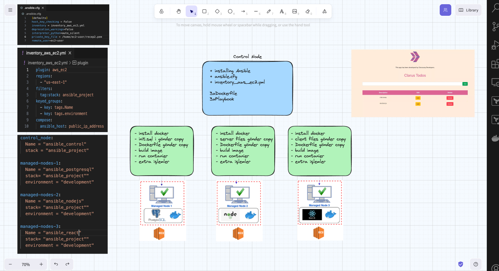

# Ansible Project

## Project Description

The Web-Page Application project aims to deploy a web page developed with Node.js and React frameworks on the AWS Cloud Infrastructure using Ansible. The infrastructure consists of 1 control node and 3 EC2 instances as worker nodes. Each EC2 instance hosts a Docker container for PostgreSQL, Node.js, and React components.




## Problem Statement

### Ansible Project

Some developers have completed the coding for a web page application. The goal is to deploy this application in a production environment using Ansible. The application allows users to register their information, and the registration data is stored in a separate PostgreSQL database located on one of the EC2 instances. The backend is controlled by Node.js, serving on port 5000, and is connected to the PostgreSQL database on port 5432. The frontend is controlled by React, serving on port 3000, and is connected to the Node.js server on port 5000.

### Project Steps

1. **Infrastructure Setup:**
    - Launch 3 EC2 instances on AWS with their respective security groups.
    - Ensure proper security group rules for each EC2 instance.
    - Use a dynamic inventory file for managing EC2 instances.

2. **Control Node Configuration:**
    - Configure the Ansible control node.
    - Pull the code from the GitHub repo.

3. **Docker Installation:**
    - Install Docker on all worker nodes using Ansible.

4. **PostgreSQL Container Setup:**
    - Send PostgreSQL files (Dockerfile and init.sql) from the control node to the PostgreSQL EC2 instance using Ansible.
    - Create a Docker image for the PostgreSQL container, setting the password as an environmental variable (protected with Ansible vault).
    - Create a PostgreSQL container and configure security groups.
    - Create a volume for the database data.

5. **Node.js Container Setup:**
    - Correct or create the .env file under the server folder based on PostgreSQL environmental variables.
    - Send Node.js server folder to the Node.js EC2 instance from the control node using Ansible.
    - Build a Docker image for the Node.js container.
    - Create a Node.js container and publish it on port 5000.

6. **React Container Setup:**
    - Correct the .env file under the client folder based on Node.js environmental variables.
    - Send the React client folder to the React EC2 instance from the control node using Ansible.
    - Create a Docker image for the React container.
    - Create a React container and publish it on port 3000.

7. **Final Steps:**
    - Ensure the web application is accessible via a web browser from anywhere on port 3000.

## Project Skeleton

```plaintext
007:ansible (folder)
|
|----Readme.md               # Project definition
|----todo-app-perm (folder)  # Node.js and React files
|       1.server (folder) ---> Node.js folders and files
|       2.client (folder) ---> React folders and files
|       3.database (folder)--> init.sql file 
|----developer_notes.txt     # Developer notes (txt file)
|----Ansible-Playbook        # Ansible playbooks (to be created by student)
